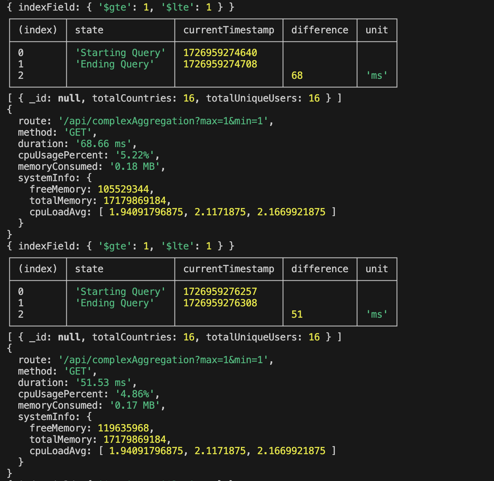
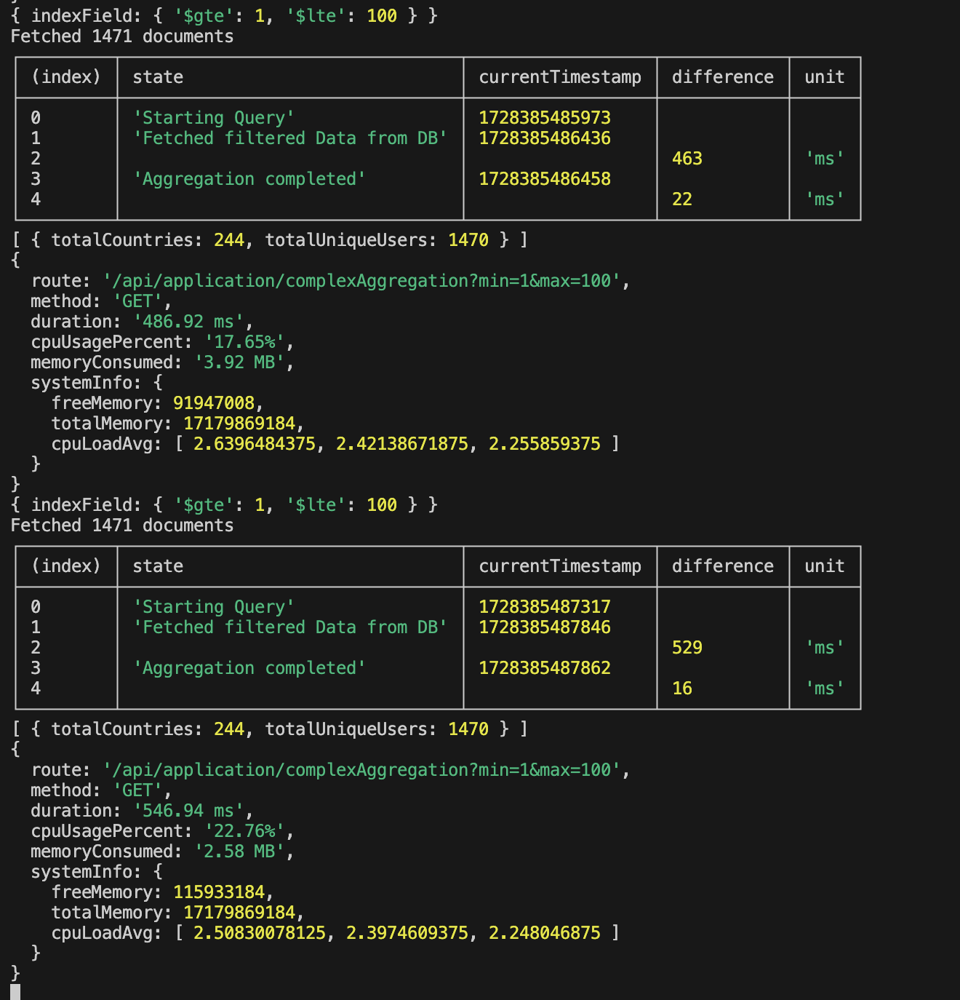
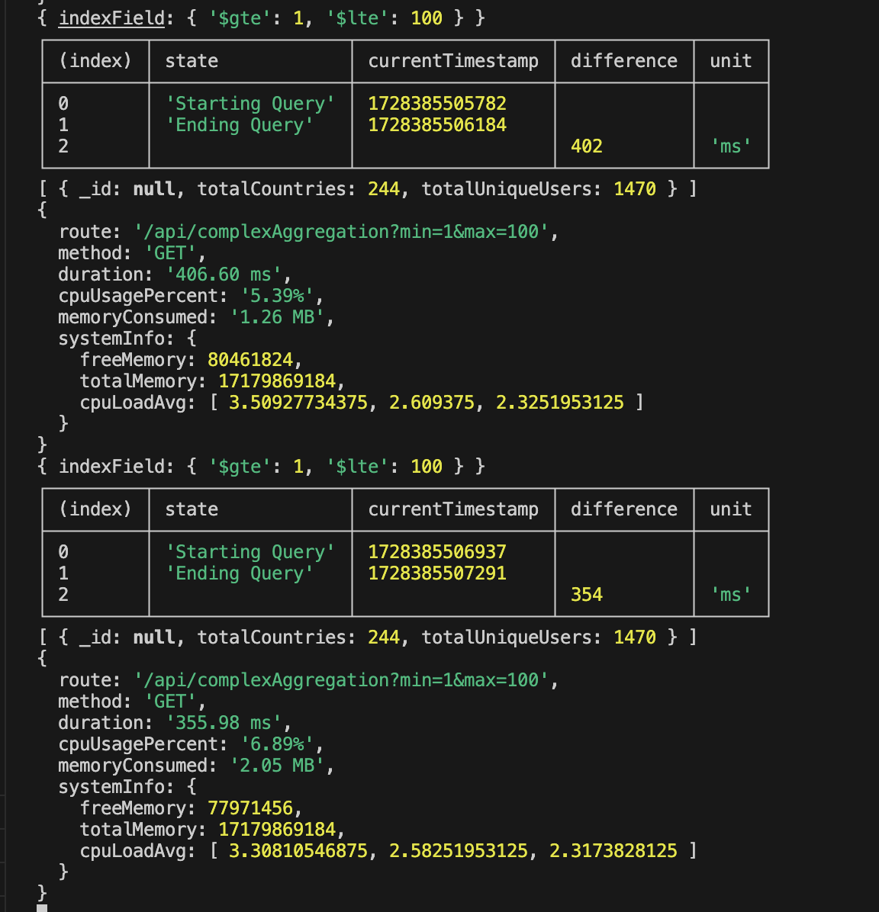
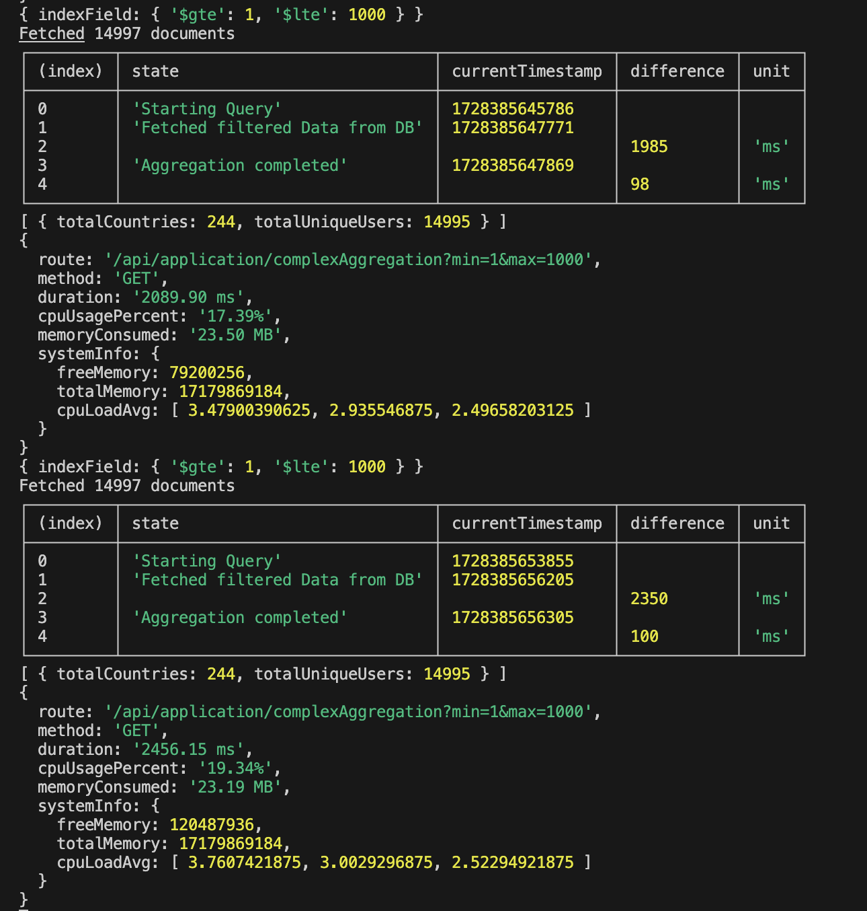
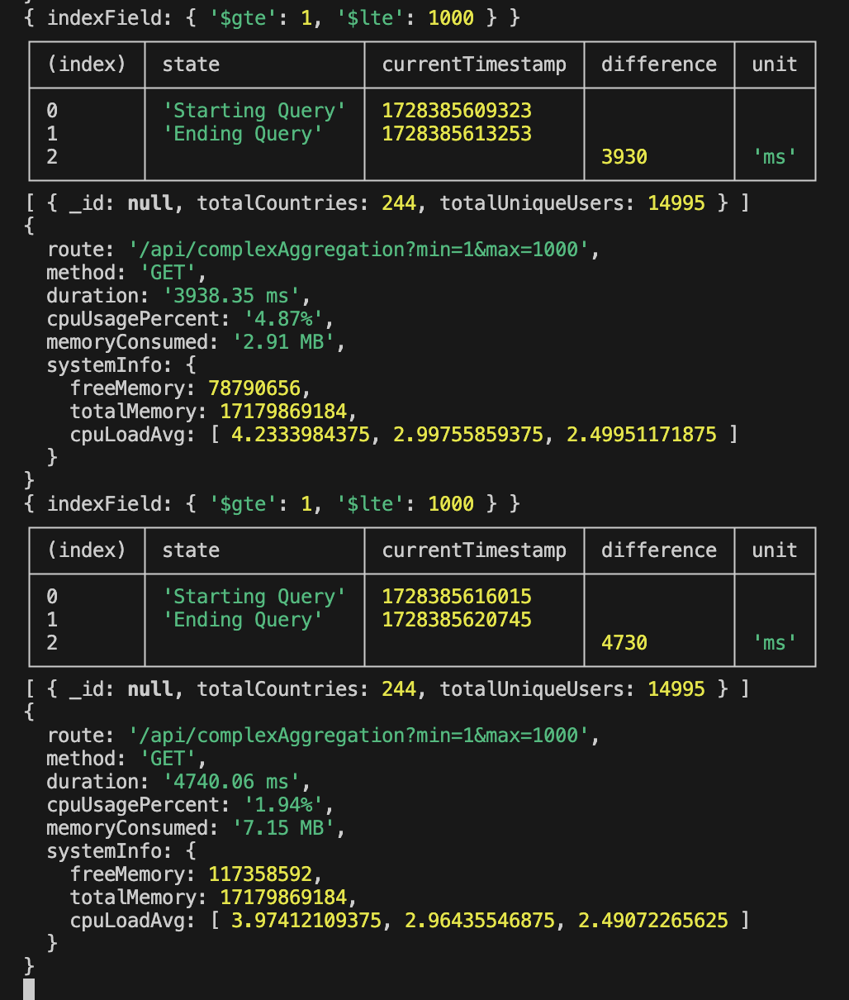

# Screenshots

This folder contains benchmark comparison images for the MongoDB Benchmarking project, showcasing performance metrics for both Application-Level and Database-Level data processing across different dataset sizes.

## Screenshot Details

### Small Filtered Dataset (1-1)
<table>
  <tr>
    <th>Application-Level Processing</th>
    <th>Database-Level Processing</th>
  </tr>
  <tr>
    <td></td>
    <td></td>
  </tr>
</table>

### Medium Filtered Dataset (1-10)
<table>
  <tr>
    <th>Application-Level Processing</th>
    <th>Database-Level Processing</th>
  </tr>
  <tr>
    <td></td>
    <td></td>
  </tr>
</table>

### Large Filtered Dataset (1-100)
<table>
  <tr>
    <th>Application-Level Processing</th>
    <th>Database-Level Processing</th>
  </tr>
  <tr>
    <td></td>
    <td></td>
  </tr>
</table>

### Extra Large Filtered Dataset (1-1000)
<table>
  <tr>
    <th>Application-Level Processing</th>
    <th>Database-Level Processing</th>
  </tr>
  <tr>
    <td></td>
    <td></td>
  </tr>
</table>
